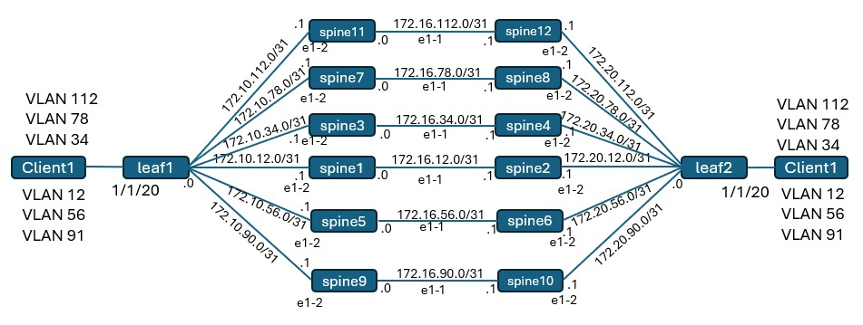

# SR Linux Workshop

This README is your starting point into the hands on section.

Pre-requisite: A laptop with SSH client.

Each participant will be assigned a Spine node. You are only required to configure your assigned spine node.

Replace the IP address in the sample configs below with your assignd Spine's IP addressing scheme. Refer to the topology diagram and the table below.

Both clients and leaf nodes are pre-configured. No additional configuration is required on them.

Shortcut links to major sections in this README:

|   |   |
|---|---|
| [Lab Topology](#lab-topology) | [Deploying the lab](#deploying-the-lab) |
| [SR Linux Commands](#sr-linux-configuration-mode) | [Configure Interfaces](#configure-interfaces) |

## Workshop
The objectives of the hands on section of this workshop are the following:
- Configure X3b interfaces
- Configure OSPF on X3b
- Configure LDP on X3b
- Establish communication between the clients

## Lab Topology



| X | Client1 IP | Client2 IP | Spine System IP |
|---|---|---|---|
| 1 | 12.12.12.100 | 12.12.12.200 | 10.10.10.10/32 |
| 2 | 12.12.12.100 | 12.12.12.200 | 20.20.20.20/32 |
| 3 | 34.34.34.100 | 34.34.34.200 | 30.30.30.30/32 |
| 4 | 34.34.34.100 | 34.34.34.200 | 40.40.40.40/32 |
| 5 | 56.56.56.100 | 56.56.56.200 | 50.50.50.50/32 |
| 6 | 56.56.56.100 | 56.56.56.200 | 60.60.60.60/32 |
| 7 | 78.78.78.100 | 78.78.78.200 | 70.70.70.70/32 |
| 8 | 78.78.78.100 | 78.78.78.200 | 80.80.80.80/32 |
| 9 | 91.91.91.91.100 | 91.91.91.91.200 | 90.90.90.90/32 |
| 10 | 91.91.91.91.100 | 91.91.91.91.200 | 100.100.100.100/32 |
| 11 | 112.112.112.100 | 112.112.112.200 | 110.110.110.110/32 |
| 12 | 112.112.112.100 | 112.112.112.200 | 120.120.120.120/32 |

## Check status of deployed lab

To display all deployed labs on your VM at any time, use:

```bash
sudo clab inspect --all
```

## Connecting to the devices

Find the nodename or IP address of the device from the above output and then use SSH to connect to your spine.

```bash
ssh leaf1
```

To login to the client, identify the client hostname using the `sudo clab inspect --all` command above and then:

```bash
sudo docker exec -it client1 bash
```

## SR Linux Configuration Mode

To enter candidate configuration edit mode in SR Linux, use:

```srl
enter candidate private
```

To commit the configuration in SR Linux, use:

```srl
commit stay
```

Here's a table with some commonly used commands.

| Action | Command |
| --- | --- |
| Enter Candidate mode | `enter candidate {private}` |
| Commit configuration changes | `commit {now\|stay}` |
| | `now` – commits and exits from candidate mode |
| | `stay` – commits and stays in candidate mode |
| Delete configuration elements | `delete` |
| | Eg: `delete interface ethernet-1/5` |
| Discard configuration changes | `discard {now\|stay}` |
| Compare candidate to running | `diff running /` |
| View configuration in current mode & context | `info {flat}` |
| View configuration in another mode & context | `info {flat} from state /interface ethernet-1/1` |
| Output modifiers | `<command> \| as {table\|json\|yaml}` |
| Access Linux shell | `bash` |
| Find a command | `tree flat detail \| grep <keyword>` |

## Configure Spine Interfaces

### System Interface

Replace `bb` with your spine's IP. Refer to the table above to get your system IP.

```
set / interface system0 admin-state enable
set / interface system0 subinterface 0 ipv4 admin-state enable
set / interface system0 subinterface 0 ipv4 address bb.bb.bb.bb/32
```

### Interface facing leaf

Refer to the topology diagram above to get the interface IP for your spine towards leaf

```
set / interface ethernet-1/2 admin-state enable
set / interface ethernet-1/2 subinterface 0 ipv4 admin-state enable
set / interface ethernet-1/2 subinterface 0 ipv4 address cc.cc.cc.cc/31
```

### Interface facing other spine

Refer to the topology diagram above to get the interface IP for your spine towards other spine

```
set / interface ethernet-1/1 admin-state enable
set / interface ethernet-1/1 subinterface 0 ipv4 admin-state enable
set / interface ethernet-1/1 subinterface 0 ipv4 address dd.dd.dd.dd/31
```

### Interface show commands

```
show interface
show interface brief
show interface detail
```

All 3 interfaces created above should be Up.

## Default Network Instance

Same config on all spine nodes

```
set / network-instance default type default
set / network-instance default admin-state enable
set / network-instance default interface ethernet-1/1.0
set / network-instance default interface ethernet-1/2.0
set / network-instance default interface system0.0
```

After committing the configuration, try a ping to the remote end of the interface facing the leaf.

```
ping cc.cc.cc.cc network-instance default
```

## Configuring OSPF

Configuring MTU (same on all spines):

```
set / system mtu default-port-mtu 8704
set / system mtu default-ip-mtu 8690
```

Replace router-id with the system IP of your spine.

```
set / network-instance default protocols ospf instance default admin-state enable
set / network-instance default protocols ospf instance default version ospf-v2
set / network-instance default protocols ospf instance default router-id bb.bb.bb.bb
set / network-instance default protocols ospf instance default area 0.0.0.0 interface ethernet-1/1.0 interface-type point-to-point
set / network-instance default protocols ospf instance default area 0.0.0.0 interface ethernet-1/2.0 interface-type point-to-point
set / network-instance default protocols ospf instance default area 0.0.0.0 interface system0.0 interface-type point-to-point
```

### OSPF show commands

```
show network-instance default protocols ospf neighbor
show network-instance default protocols ospf interface
show network-instance default protocols ospf database
```

Both OSPF neighbors should be Up on your assigned spine.

## Check Route Table on Spine

```
show network-instance default route-table
```

## Configuring LDP

Create MPLS label range for LDP (same config on all spines)

```
set / system mpls label-ranges dynamic ldp-block start-label 11000
set / system mpls label-ranges dynamic ldp-block end-label 11999
```

Configure LDP (same config on all spines)

```
set / network-instance default protocols ldp admin-state enable
set / network-instance default protocols ldp dynamic-label-block ldp-block
set / network-instance default protocols ldp discovery interfaces interface ethernet-1/1.0 ipv4 admin-state enable
set / network-instance default protocols ldp discovery interfaces interface ethernet-1/2.0 ipv4 admin-state enable
```

### LDP show commands

```
show network-instance default protocols ldp neighbor
show network-instance default protocols ldp session
show network-instance default protocols ldp ipv4 fec
```

There should 2 LDP sessions Up - 1 to the other spine and 1 to the leaf.

## Ping between clients

Now, ping should work between the clients.

Login to Client1 and ping the remote IP for your assigned VLAN. Refer to the table above.

```
sudo docker exec -it client1 bash
```

```
ping yy.yy.yy.yy
```


